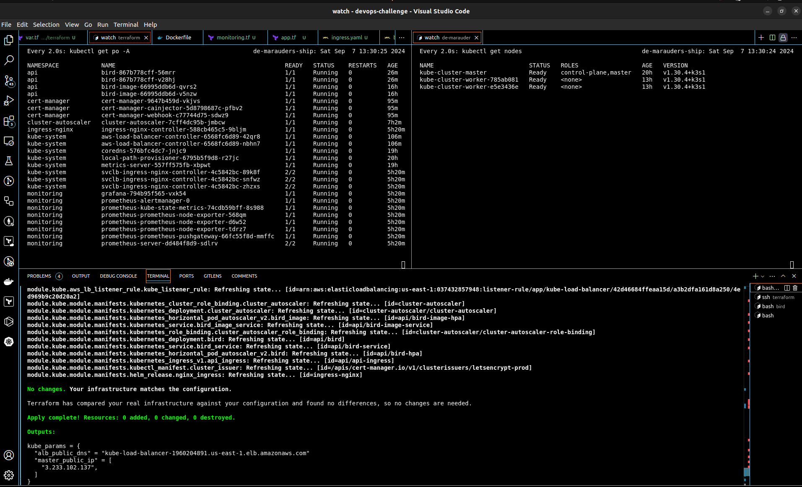
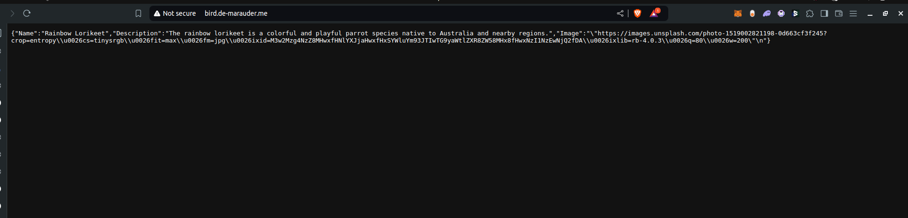
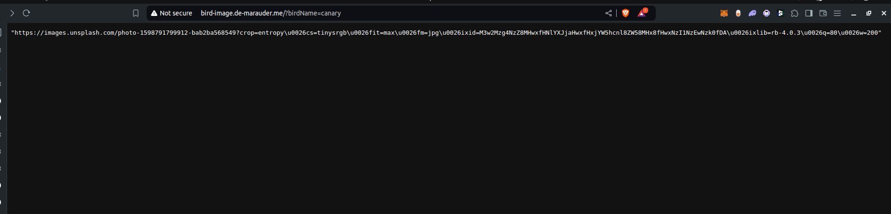
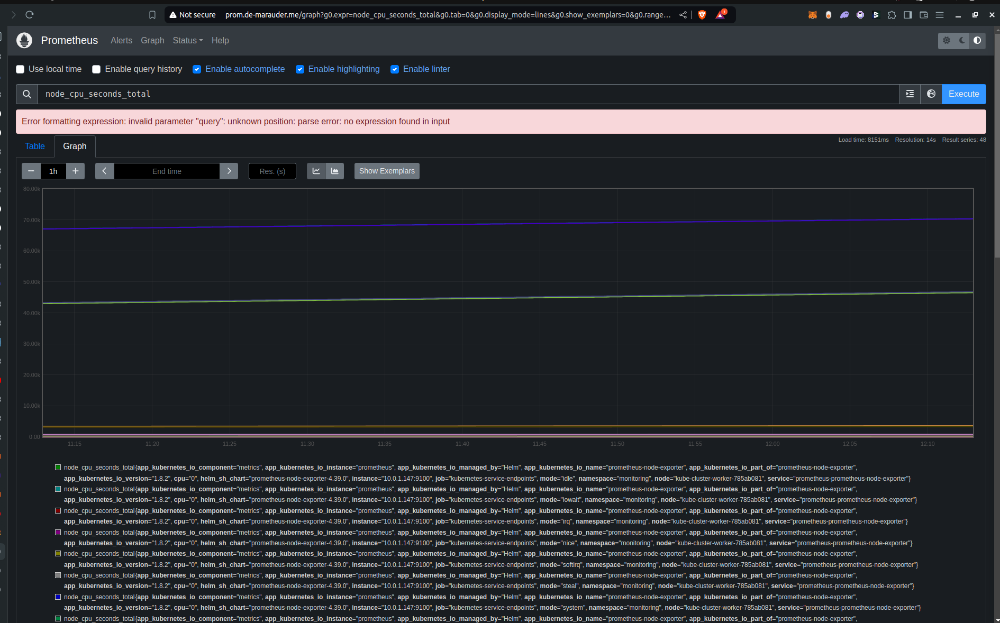
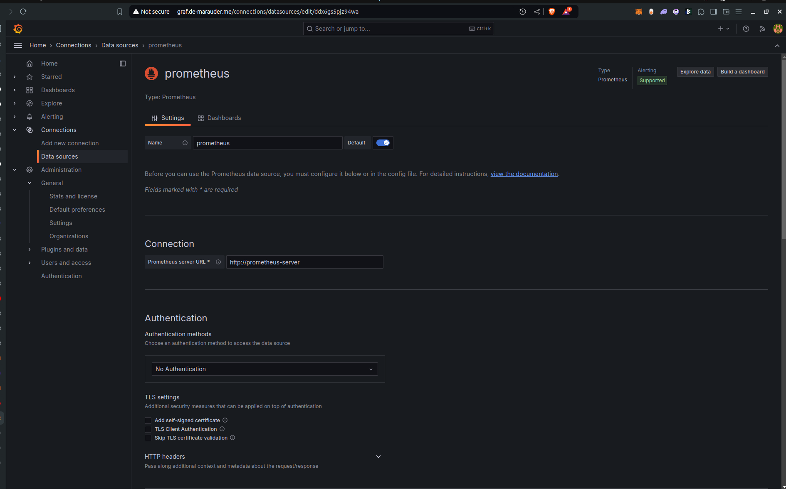
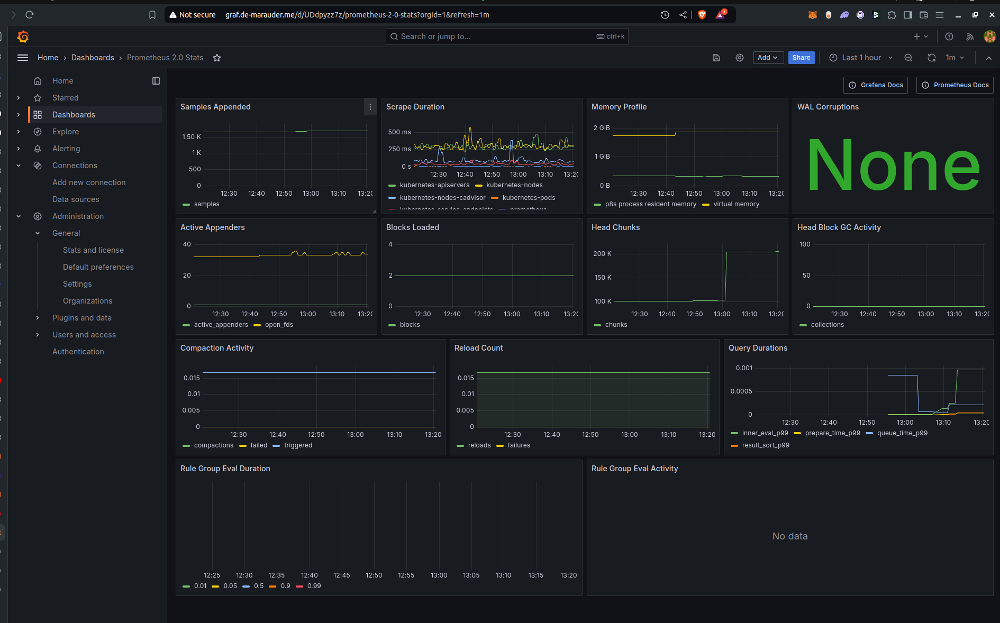

# Kube-Scratch

This repository describes a lean approach to setting up a multi node kubernetes cluster on AWS using k3s. It consists of the `terraform` code to deploy the infrastructure (kube cluster), two golang microservices (a bird application) and a helm chart to deploy them.

# Bird Application

This is the bird Application! It gives us birds!!!

The app is written in Golang and contains 2 APIs:
- the bird API
- the birdImage API

# Installation & how to run it

- In each of the API directories, there's a makefile. Run `make` in each directory to install dependencies and build the go binary and run the output binaries
  ```
  cd bird
  make
  ./getBird
  # Application server is started on port 4201

  ##################################

  cd birdImage
  make
  ./getBirdImage
  # Application server is started on port 4200
  ```
- You can proceed to test with any http client of your choice like `curl` or `postman`
- Going through the code shows that the bird API depends on the birdImage API. To work with this, the `localhost` reference has been swapped with an environment variable called `BIRD_API_HOST`. This will allow us to supply a custom value when building or running the application container.


# Challenge

- [x] Setup microservices
- [x] Dockerize it (create dockerfile for each API)
- [x] Create an infra on AWS (VPC, SG, instances) using IaC
  > - Made use of core AWS infrastructure: EC2, Auto Scaling Groups (ASG) and launch templates, and Application load balancer (ALB) to build out the functionality of the nodes
  > - Entire infrastructure was implemented in terraform as IaC using terraform primitives like null resources and local-exec provisioners to ensure that the entire setup was one step automated (just run apply once)
  > - Components of the infrastructure were logically organized into modules. There's one for the core infrastructure and another for the kubernetes manifests.
- [x] Install a small version of kubernetes on the instances (no EKS)
  > Made use of k3s to provision a light weight kubernetes multi-node cluster
- [x] Build the manifests to run the 2 APIs on k8s
  > - The kubernetes manifests were built out in both [terraform](./infra/terraform/manifests/) and [yaml](./infra/k8s/) 
- [x] Bonus points: observability, helm, scaling
  > - Employed prometheus and grafana as monitoring tools
  > - Implemented horizontal pod autoscaling for both APIs and cluster autoscaling using Kubernetes `ClusterAutoScaler` ensuring to grant least IAM privileges via roles and service accounts so that the workers (EC2 instances) only have access to what they need in order to reduce the blast radius in case of attacks.
  > - Made use of the helm as a package manager for the following tools
  >    - ingress-nginx
  >    - aws-loadbalancer-controller
  >    - prometheus
  >    - grafana
  >    - cert-manager

### Extras:
- Use security / container / k8s / cloud best practices
  > Made use of private subnets and security groups to lock down access to the cluster
- Change in the source code is possible
  > Update the bird API to accept the hostname and port number of the bird-image api as environment variables 

For more information on the infrastructure please visit [here](./infra/README.md)

## Results
  > 
---
In total, 4 ingresses were deployed to test the setup

- bird.de-marauder.me
  > 
- bird-image.de-marauder.me
  > 
- prom.de-marauder.me
  > 
- graf.de-marauder.me
  > 
  > 
  