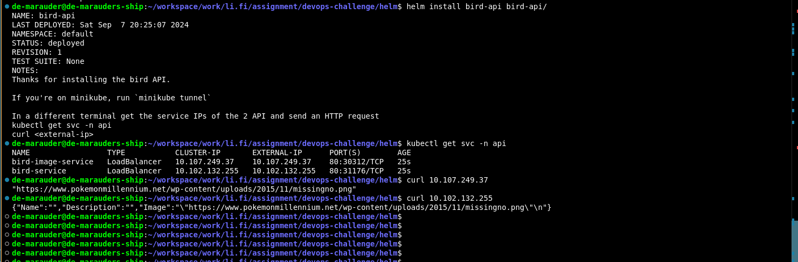

# Helm chart for the bird API and bird-image API.
This chart includes the manifests required to deploy the two bird APIs

## Requirements
- kubernetes cluster: minikube, kind or k3s will serve
- helm package

# How to use
1. First change directory to the helm directory
      ```bash
      cd helm
      ```
2. Install the chart
   ```
   # create the `api` namespace
   kubectl create ns api
   helm install bird-api bird-api
   ```
3. List the available charts
    ```
    helm list
    ```
4. List kubernetes services and curl the external IP
   ```
   kubectl get svc -n api
   curl <external-IP>
   ```

### Example
